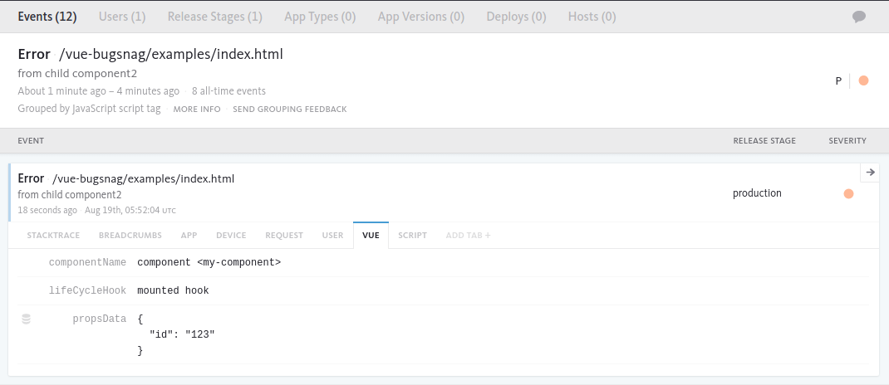

# Vue Bugsnag

[](https://vuejs.org/)
[](https://www.npmjs.com/package/vue-bugsnag)
[](https://www.npmjs.com/package/vue-bugsnag)
[](https://github.com/ankurk91/vue-bugsnag/)
[]()

Vue.js plugin for [bugsnag-js](https://github.com/bugsnag/bugsnag-js) error reporting



## Installation
```bash
# npm
npm install vue-bugsnag --save

# Yarn
yarn add vue-bugsnag
```

## Usage
* Grab your API key from [Bugsnag](https://www.bugsnag.com/)
```js
import Bugsnag from 'bugsnag-js';
Bugsnag.apiKey = "YOUR-API-KEY-HERE";
```
* Plug into Vue.js
```js
import Vue from 'vue';
import VueBugsnag from 'vue-bugsnag';
Vue.use(VueBugsnag);
```
* Prevent Bugsnag from being initialized in development
```js
if (process.env.NODE_ENV === 'production') {
  //Initialize Bugsnag here
}
```

* Limit error reporting to specific release stages

```js
Bugsnag.notifyReleaseStages = ['staging', 'production'];
```

## Use with Vue Router
* Use an `afterEach` [navigation guard](https://router.vuejs.org/en/advanced/navigation-guards.html) to reset the Bugsnag error limit.

```js
router.afterEach((to, from) => {
    Bugsnag.refresh();
});
```

## Use in browser (without webpack)
* Include required files
```html
<!-- Add bugsnag core library -->
<script src="//d2wy8f7a9ursnm.cloudfront.net/bugsnag-3.min.js"
        data-apikey="YOUR-API-KEY-HERE"></script>
<!-- Vue js -->
<script src="https://unpkg.com/vue@2.4.2/dist/vue.min.js"></script>
<!-- Lastly add this package -->
<script src="https://unpkg.com/vue-bugsnag"></script>
```
* That's it, plugin will auto initialize.

## How does it work?
* This plugin utilize Vue.js inbuilt [error handler](https://vuejs.org/v2/api/#errorHandler)
* This plugin prepares a payload and send this to Bugsnag as [metadata](https://docs.bugsnag.com/platforms/browsers/#custom-diagnostics)
* This metadata will appear on a new tab in Bugsnag dashboard.

### Credits
* [raven-js](https://github.com/getsentry/raven-js)

### License
[MIT](LICENSE.txt) License
